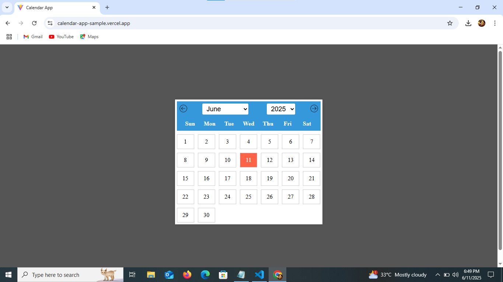
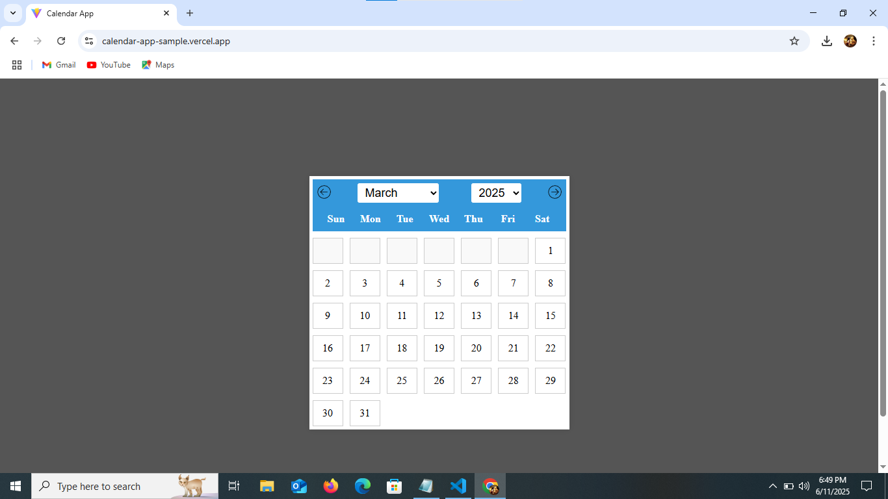

# React Calendar App

This is a responsive and user-friendly calendar application built using **React**. It displays the days of the selected month and year, highlights the current day, and allows navigation through months and years.

## Demo

 🔗 **Live Link**: [Click here to view the demo](https://calendar-app-sample.vercel.app/)

## Screenshot





## Features

- Displays full calendar view of the selected month.
- Navigate to previous or next month.
- Select any month and year from dropdowns.
- Highlights today’s date.
- Fully responsive design.


## Getting Started

### 1. Clone the Repository
```bash
git clone https://github.com/your-username/react-calendar-app.git
cd react-calendar-app
### 2. Install Dependencies
```bash npm install
### 3. Run the App
```bash npm run dev
The app will start at http://localhost:3000

# Tech Stack
-React
-JavaScript
-HTML5
-CSS3
